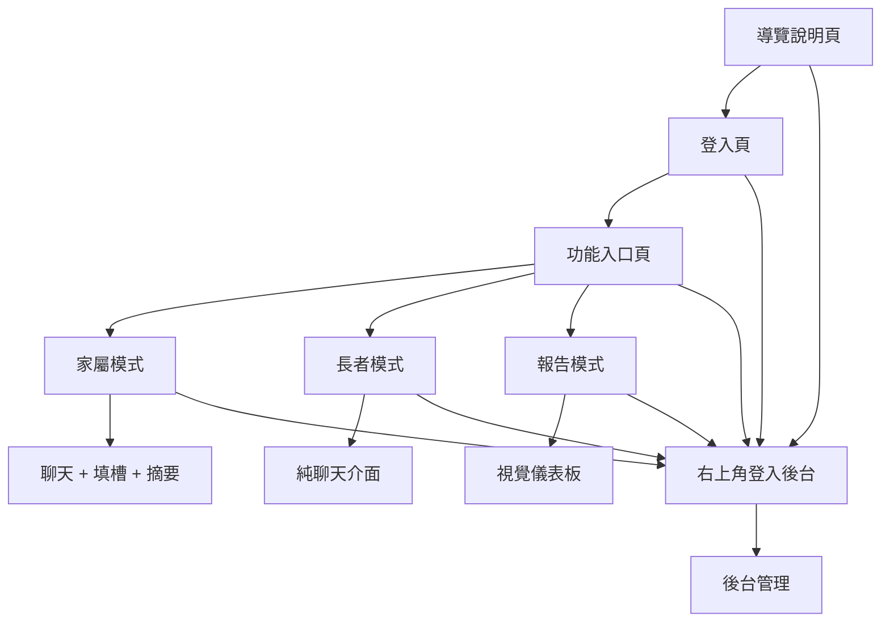
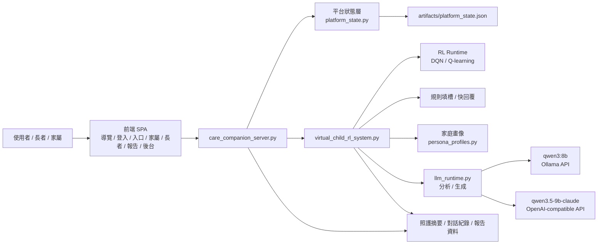
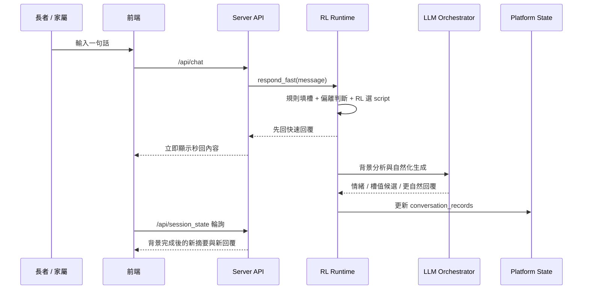
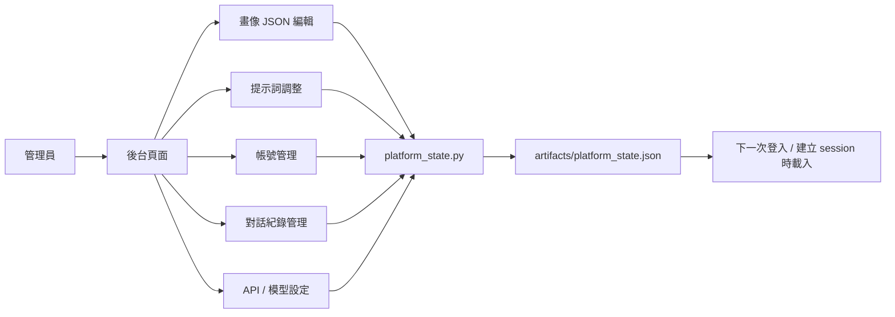

# 虛擬子女照護陪伴系統

以「虛擬兒女」為核心角色的高齡照護陪伴原型。系統把 `RL 劇本策略選擇`、`LLM 理解與生成`、`家庭畫像`、`登入入口`、`報告儀表板`、`後台管理` 整合成同一套網站與本地執行環境。

目前版本已經不是單純的聊天 demo，而是可實際操作的產品型流程：

1. 先進入導覽說明頁
2. 再使用家庭帳號登入
3. 登入後選擇進入 `家屬` / `長者` / `報告`
4. 右上角可再登入 `後台管理`

---

## 1. 專案目標

這個專案要解決的不是「做一個會聊天的機器人」而已，而是做一個更像真實兒女的照護陪伴系統：

- 能用熟悉的稱呼和口氣和長者對話
- 能延續家庭關係與既有相處模式
- 能在聊天中隱性引導蒐集照護資訊
- 能把對話整理成家屬可讀的照護摘要
- 能保留管理入口，讓後台調整畫像、提示詞、帳號與 API

---

## 2. 目前已完成的產品流程

### 2.1 前台使用流程



### 2.2 各頁面用途

| 頁面 | 主要輸入 | 主要輸出 | 用意 |
|---|---|---|---|
| 導覽說明頁 | 無 | 系統介紹、三組家庭畫像預覽 | 先讓使用者理解產品與角色設定 |
| 登入頁 | 帳號、密碼 | 使用者 session | 依家庭角色登入系統 |
| 功能入口頁 | 點選模式 | 導向家屬 / 長者 / 報告 | 避免所有資訊都塞在同一頁 |
| 家屬模式 | 對話輸入 | 對話、填槽、分析結果、照護摘要 | 給家屬完整工作台 |
| 長者模式 | 對話輸入 | 純聊天畫面 | 給長者更單純、更像和兒女聊天的體驗 |
| 報告模式 | 無或看歷史紀錄 | 視覺儀表板、對話紀錄、進度與提醒 | 給家屬或照護者快速巡檢 |
| 後台管理 | JSON、表單、帳號資料 | 更新畫像、提示詞、帳號、API、紀錄 | 讓系統可配置、可維運 |

---

## 3. 核心做法

### 3.1 設計原則

系統不是用單一 LLM 直接自由聊天，而是採用下列混合設計：

1. `RL` 決定下一個優先對話方向
2. `規則 / 正則` 先做快速填槽與快回覆
3. `LLM` 背景補上情緒分析、槽值候選與自然化回覆
4. `Persona` 控制稱呼、關係、語氣與隱性引導方式
5. `後台` 讓這些設定能被修改，而不是寫死在程式裡

### 3.2 為什麼要用 RL

LLM 很擅長理解和生成，但不一定穩定地追蹤「四大照護槽位到底還缺哪一塊」。  
RL 在這個專案裡的角色不是生成句子，而是做「策略選擇」：

- 下一步優先追哪個槽位
- 用哪一份 script 比較合適
- 高偏離時要不要轉場
- 尚未完成的槽位要不要優先補齊

也就是說：

- `RL` 負責「方向」
- `LLM` 負責「理解與說法」

---

## 4. 系統架構圖



---

## 5. 資訊流

### 5.1 即時對話資訊流



### 5.2 後台資訊流



---

## 6. 四大槽位與用途

系統目前固定追蹤四大照護槽位：

| 主槽位 | 子槽位 | 用意 |
|---|---|---|
| 用藥狀況 | 量血壓情況、服藥情況、身體不適、用藥時間 | 追蹤服藥與身體警訊 |
| 睡眠狀態 | 起床時間、睡眠時間、小睡情況、睡眠品質 | 觀察作息與睡眠品質 |
| 作息活動 | 上廁所情況、居家運動、外出情況、洗澡情況、喝水情況、看電視情況 | 評估活動量與日常功能 |
| 飲食狀況 | 三餐時間、食物內容、廚房使用、冰箱使用 | 觀察飲食與生活自理程度 |

### 槽位輸入與輸出

| 項目 | 輸入 | 輸出 |
|---|---|---|
| 規則填槽 | 長者訊息文字 | `filled_slots`、`slot_value_details` |
| LLM 補充 | 長者訊息、最近對話、persona、當前槽位 | `slot_candidates`、`emotion`、`concerns` |
| 報告顯示 | 已填槽資料 | 完成度、值摘要、提醒與焦點建議 |

---

## 7. 強化學習用途說明

### 7.1 RL 在本專案中的定位

RL 不負責逐字生成回覆，而是負責：

- 選 `下一個 script`
- 選 `下一個 target_slot`
- 選 `是否轉場`
- 優先補尚未完成的槽位

### 7.2 狀態、動作、獎勵

| 元素 | 內容 | 說明 |
|---|---|---|
| State | 5 維向量 | `4 個槽位是否已有資料 + 1 個上一輪是否高偏離` |
| Action | 12 個 script action | 對應 12 份對話劇本 |
| Reward | 由 `R_data.py` 計算 | 綜合槽位完成、偏離、轉場與對話品質 |

### 7.3 訓練與執行

| 階段 | 檔案 | 用途 |
|---|---|---|
| 訓練資料 | `rl_data_*.json` | 來自模擬對話與 reward 計算 |
| DQN 訓練 | `integrated_dqn_train.py` | 訓練神經網路版 policy |
| Q-learning 訓練 | `integrated_dqn_train.py --algorithm q_learning` | 訓練表格式 policy |
| 線上推論 | `virtual_child_rl_system.py` | 依目前狀態選出下一份 script |

### 7.4 為什麼不是只用 LLM

如果只用 LLM：

- 對話可能自然，但不一定穩定補齊四大槽位
- 不容易比較策略優劣
- 不容易控制追問優先順序

如果加入 RL：

- 可以明確比較 `DQN` 和 `Q-learning`
- 可以在缺資料時優先追對應槽位
- 可以把「選策略」和「說法自然化」拆開

---

## 8. Persona 與家庭畫像

系統目前內建 3 組家庭畫像，每組有：

- 兒女姓名、角色、職業、個性、說話風格
- 長者姓名、角色、生活狀態、健康重點、興趣
- 家庭關係、共同回憶、引導風格

### 8.1 三組內建畫像

| ID | 家庭畫像 | 關係 |
|---|---|---|
| `daughter_teacher_mother` | 長女曉雯與母親玉蘭 | 曉雯是玉蘭的長女，玉蘭是曉雯的母親 |
| `son_engineer_father` | 次子家豪與父親正雄 | 家豪是正雄的次子，正雄是家豪的父親 |
| `daughter_nurse_mother` | 小女兒雅婷與母親秀琴 | 雅婷是秀琴的小女兒，秀琴是雅婷的母親 |

### 8.2 Persona 的實際作用

Persona 不只是顯示資料，而是真的會進入：

- 開場稱呼
- 快回覆的語氣
- LLM 分析 prompt
- LLM 生成 prompt
- 家屬摘要與報告儀表板

---

## 9. 預設帳號

系統目前會在首次啟動時建立 `artifacts/platform_state.json`，並生成以下示範帳號。

### 9.1 家庭帳號 6 組

| 家庭 | 角色 | 帳號 | 密碼 |
|---|---|---|---|
| 長女曉雯與母親玉蘭 | 家屬 | `xiaowen.family` | `XWFamily#2026` |
| 長女曉雯與母親玉蘭 | 長者 | `yulan.elder` | `YuLan#2026` |
| 次子家豪與父親正雄 | 家屬 | `jiahao.family` | `JHFamily#2026` |
| 次子家豪與父親正雄 | 長者 | `zhengxiong.elder` | `ZXElder#2026` |
| 小女兒雅婷與母親秀琴 | 家屬 | `yating.family` | `YTFamily#2026` |
| 小女兒雅婷與母親秀琴 | 長者 | `xiuqin.elder` | `XiuQin#2026` |

### 9.2 後台帳號

| 角色 | 帳號 | 密碼 |
|---|---|---|
| 管理員 | `admin.console` | `Admin#2026` |

> 注意：目前這是 demo / prototype 等級的本機帳號系統，密碼儲存在 JSON 中，方便展示與修改，不適合直接上正式生產環境。

---

## 10. 詳細輸入輸出

## 10.1 主要前端模式

| 模式 | 主要輸入 | 主要輸出 |
|---|---|---|
| 家屬模式 | 長者回覆文字、登入家庭帳號 | 對話區、互動摘要、家庭關係畫像、分析結果、四大槽位進度、照護提醒、家屬摘要 |
| 長者模式 | 長者回覆文字、登入長者帳號 | 純聊天區 |
| 報告模式 | 已存在的對話紀錄 | 最新互動概況、歷史紀錄、對話時間線、家庭畫像、分析結果、四大槽位進度、照護提醒、家屬摘要 |
| 後台模式 | 畫像 JSON、提示詞、帳號資料、模型設定 | 更新平台設定並寫回 `platform_state.json` |

## 10.2 主要 API

### `/api/bootstrap`

用途：前端初始載入導覽頁、登入頁和示範帳號。

輸入：

```json
{}
```

輸出：

```json
{
  "demo_accounts": [
    {
      "username": "xiaowen.family",
      "password": "XWFamily#2026",
      "display_name": "曉雯家屬帳號",
      "role": "family",
      "persona_profile_id": "daughter_teacher_mother",
      "persona_label": "長女曉雯與母親玉蘭"
    }
  ],
  "admin_account": {
    "username": "admin.console",
    "password": "Admin#2026"
  },
  "personas": {},
  "api_settings": {},
  "prompt_settings": {}
}
```

### `/api/login`

用途：一般使用者登入。

輸入：

```json
{
  "username": "xiaowen.family",
  "password": "XWFamily#2026"
}
```

輸出：

```json
{
  "auth_token": "token",
  "user": {
    "username": "xiaowen.family",
    "role": "family",
    "persona_profile_id": "daughter_teacher_mother"
  },
  "bootstrap": {}
}
```

### `/api/session`

用途：登入後建立新的對話 session。

輸入：

```json
{
  "auth_token": "token",
  "algorithm": "dqn",
  "llm_enabled": true,
  "analysis_preset": "qwen35_lmstudio",
  "generation_preset": "qwen35_lmstudio"
}
```

輸出：

```json
{
  "session_id": "session-id",
  "latest_assistant_message": "媽，你今天早上有去練氣功嗎？",
  "persona_profile": {},
  "summary": {},
  "turns": []
}
```

### `/api/chat`

用途：送出一輪對話，先回快速回覆，再背景補分析。

輸入：

```json
{
  "auth_token": "token",
  "session_id": "session-id",
  "message": "我今天早餐吃稀飯，剛剛也有出去走一下。"
}
```

輸出：

```json
{
  "latest_assistant_message": "媽，有把東西吃一點、喝一點都很重要。順著您剛剛提到的，你早餐都喜歡吃些什麼呢？",
  "background_processing": true,
  "latest_analysis": {
    "status": "pending"
  },
  "summary": {},
  "turns": []
}
```

### `/api/session_state`

用途：輪詢背景分析是否完成。

輸入：

```json
{
  "auth_token": "token",
  "session_id": "session-id"
}
```

輸出：

```json
{
  "background_processing": false,
  "latest_assistant_message": "背景自然化後的最新回覆",
  "latest_analysis": {
    "status": "completed",
    "summary": "分析摘要"
  }
}
```

### `/api/report`

用途：讀取同一家族的最新報告與歷史紀錄。

輸入：

```json
{
  "auth_token": "token"
}
```

輸出：

```json
{
  "records": [],
  "latest_session": {
    "summary": {},
    "turns": []
  }
}
```

### `/api/admin/state`

用途：後台一次讀出所有管理資料。

輸入：

```json
{
  "auth_token": "admin-token"
}
```

輸出：

```json
{
  "users": [],
  "personas": {},
  "prompt_settings": {},
  "api_settings": {},
  "conversation_records": []
}
```

### 10.3 後台管理 API

| Endpoint | 用途 | 輸入重點 | 輸出 |
|---|---|---|---|
| `/api/admin/persona/update` | 更新單一畫像 | `profile_id`, `profile` | `{"ok": true}` |
| `/api/admin/persona/import` | 批次匯入畫像 JSON | `raw_text` | `{"ok": true}` |
| `/api/admin/prompts/update` | 更新 prompt 附加指令 | `prompt_settings` | `{"ok": true}` |
| `/api/admin/users/upsert` | 新增或修改帳號 | `user` | `{"ok": true}` |
| `/api/admin/users/delete` | 刪除帳號 | `user_id` | `{"ok": true}` |
| `/api/admin/api/update` | 更新預設演算法與模型設定 | `api_settings` | `{"ok": true}` |
| `/api/admin/records/delete` | 刪除對話紀錄 | `session_id` | `{"ok": true}` |

---

## 11. 模組與每個檔案的用意

| 檔案 / 目錄 | 用意 | 主要輸入 | 主要輸出 |
|---|---|---|---|
| `care_companion_server.py` | 提供整個網站與 API | HTTP Request | 前端頁面、JSON API |
| `care_frontend/app.js` | 前端單頁流程控制 | 使用者點擊、表單輸入、API 回應 | 導覽頁、登入頁、三種模式、後台畫面 |
| `care_frontend/styles.css` | 前端樣式系統 | HTML 結構 | 視覺版面 |
| `virtual_child_rl_system.py` | 核心對話 runtime | 長者訊息、persona、RL policy、prompt settings | 快回覆、背景分析、摘要、turns |
| `llm_runtime.py` | LLM 連線與 prompt orchestration | persona、對話上下文、槽位資料 | 分析結果、自然化回覆 |
| `platform_state.py` | 平台資料層 | 帳號、畫像、prompt、API 設定、紀錄 | `platform_state.json` |
| `persona_profiles.py` | 內建家庭畫像 | profile id | persona profile |
| `integrated_dqn_train.py` | RL 訓練入口 | `rl_data_*.json` | DQN / Q-learning 模型 |
| `dueling_dqn.py` | DQN agent | state/action/reward | DQN policy |
| `tabular_q_learning.py` | Q-learning agent | state/action/reward | Q-table |
| `R_data.py` | reward 計算 | 對話資料、填槽進度、偏離資訊 | reward |
| `artifacts/platform_state.json` | 平台持久化資料 | 後台編輯後寫入 | 下次啟動繼續使用 |

---

## 12. LLM 與回覆策略

### 12.1 模型預設

| Preset | Provider | Model | 用途 |
|---|---|---|---|
| `qwen3_ollama` | Ollama | `qwen3:8b` | 可用於本地分析 / 生成 |
| `qwen35_lmstudio` | OpenAI-compatible | `qwen3.5-9b-claude` | 目前預設分析 / 生成模型 |

### 12.2 回覆模式

| 模式 | 做法 | 目的 |
|---|---|---|
| 快回覆 | 規則判斷 + persona 語氣 + RL 目標槽位 | 讓畫面先秒回 |
| 背景分析 | LLM 情緒分析、填槽候選、偏離判斷 | 補理解 |
| 背景自然化 | LLM 根據 persona 與 target_slot 生成更自然回覆 | 補說法 |

### 12.3 Persona 如何影響 LLM

LLM prompt 會帶入：

- child / elder 姓名與角色
- preferred address，例如 `媽`、`爸`
- personality
- speaking_style
- care_habits
- relationship dynamic
- guidance_style

因此回覆會比較像：

- `媽，我有在聽，您慢慢說就好。`
- `爸，先記下來，我順便確認一下今天這餐大概幾點吃的呢？`

而不是一般客服式問句。

---

## 13. 安裝與執行

### 13.1 建立虛擬環境

```powershell
Set-Location 'C:\Users\15507\Desktop\老人'
py -3.13 -m venv .venv
.\.venv\Scripts\Activate.ps1
pip install -r requirements.txt
```

如果 PowerShell 阻擋：

```powershell
Set-ExecutionPolicy -Scope Process -ExecutionPolicy Bypass
.\.venv\Scripts\Activate.ps1
```

### 13.2 啟動網站

```powershell
Set-Location 'C:\Users\15507\Desktop\老人'
.\.venv\Scripts\python.exe care_companion_server.py --open-browser
```

瀏覽器網址：

```text
http://127.0.0.1:8000
```

### 13.3 CLI runtime 測試

```powershell
.\.venv\Scripts\python.exe virtual_child_rl_system.py --mode demo --algorithm dqn
.\.venv\Scripts\python.exe virtual_child_rl_system.py --mode demo --algorithm q_learning
.\.venv\Scripts\python.exe virtual_child_rl_system.py --mode interactive --algorithm dqn
```

### 13.4 RL 訓練測試

```powershell
.\.venv\Scripts\python.exe integrated_dqn_train.py --algorithm dqn --input rl_data_20250721_142929.json --epochs 5 --save-interval 1 --batch-size 16 --output-dir outputs_dqn_smoke
.\.venv\Scripts\python.exe integrated_dqn_train.py --algorithm q_learning --input rl_data_20250721_142929.json --epochs 5 --save-interval 1 --batch-size 16 --output-dir outputs_q_learning_smoke
```

### 13.5 可行性檢查

```powershell
.\.venv\Scripts\python.exe tools\feasibility_check.py
```

---

## 14. 建議測試清單

### 14.1 前台流程

1. 打開首頁，確認先看到導覽說明頁
2. 進入登入頁，使用示範帳號登入
3. 進入功能入口頁
4. 分別點進 `家屬` / `長者` / `報告`
5. 右上角進入 `登入後台`

### 14.2 對話流程

1. 建立 session
2. 輸入一段與飲食或活動相關的文字
3. 確認畫面先秒回
4. 等待背景分析完成
5. 確認 `四大槽位進度` 和 `報告模式` 有更新

### 14.3 後台流程

1. 後台登入
2. 修改其中一組 persona JSON
3. 儲存後重新登入該家庭帳號
4. 確認新稱呼 / 新畫像已生效
5. 修改 prompt settings
6. 修改或新增帳號
7. 刪除舊對話紀錄

---

## 15. 目前限制

### 15.1 帳號系統

目前是 demo 級做法：

- 明文密碼
- 本機 JSON 儲存
- 記憶體 token
- 無正式 RBAC / session 過期策略

### 15.2 畫像持久化

畫像與設定目前存於：

```text
artifacts/platform_state.json
```

適合原型展示與功能驗證，但正式產品建議改成資料庫。

### 15.3 LLM 分析摘要

雖然 prompt 已要求繁中，但部分模型回傳摘要仍可能夾帶英文，需要再做輸出正規化。

### 15.4 語音與多端同步

目前網站版本以文字互動為主，尚未完成：

- 真正的 STT / TTS 服務端整合
- 手機端同步登入
- 雲端資料庫
- 正式權限管理

---

## 16. 後續可擴充方向

1. 把 `platform_state.json` 改成 SQLite / PostgreSQL
2. 加入密碼雜湊與正式登入機制
3. 增加長期記憶，讓虛擬兒女記得上次聊過的家族事件
4. 讓 LLM 不只判斷子槽位，還能抽出更完整結構化值
5. 加入音訊 I/O 與行動端 UI
6. 增加更多家庭畫像模板與後台上傳格式驗證

---

## 17. 快速總結

這個專案目前已具備以下能力：

- `導覽頁 -> 登入 -> 功能入口 -> 家屬 / 長者 / 報告 -> 後台`
- `6 個家庭示範帳號 + 1 個後台帳號`
- `3 組可切換家庭畫像`
- `DQN / Q-learning 雙策略`
- `快回覆 + 背景 LLM 分析/生成`
- `家屬摘要與報告儀表板`
- `後台修改畫像、提示詞、帳號、對話紀錄、API 設定`

如果你要把這份專案拿去做簡報、交付或展示，這份 README 已經可以作為：

- 產品說明文件
- 系統架構文件
- API 參考文件
- 操作手冊
- 專案交付說明
